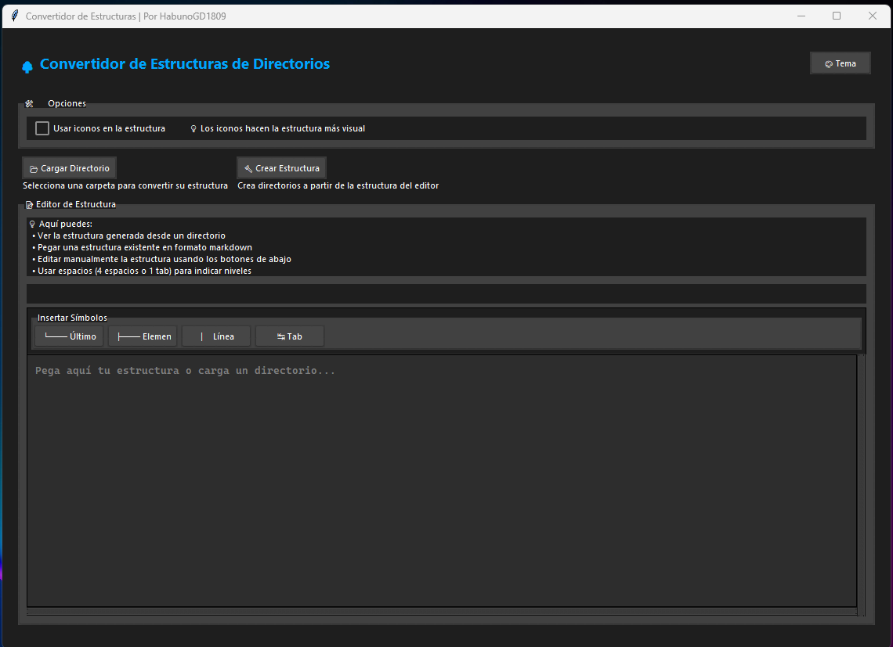
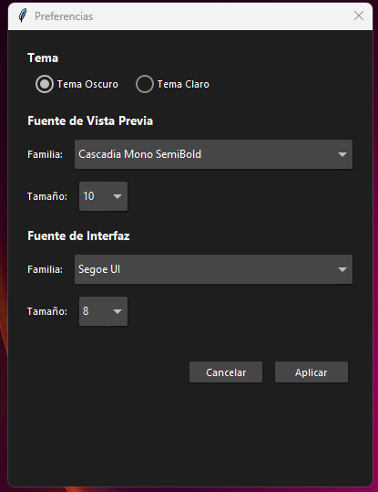

# 🌳 Convertidor de Estructuras de Directorios

Una aplicación de escritorio construida con Python y Tkinter que permite visualizar y manipular estructuras de directorios de manera intuitiva.

<table>
  <tr>
    <td></td>
    <td></td>
  </tr>
</table>

## 📋 Características

- 📁 Convierte directorios en estructuras visuales
- 🔄 Genera estructuras en formato markdown o con iconos
- 📝 Editor integrado con herramientas de formato
- 🎨 Tema claro/oscuro personalizable
- 💾 Guarda y carga estructuras en formato markdown
- 📋 Copiar y pegar estructuras fácilmente

## 🚀 Instalación

### Prerrequisitos

- Python 3.8 o superior
- pip (gestor de paquetes de Python)

### Pasos de instalación

1. Clona el repositorio:
```bash
git clone https://github.com/HabunoGD1809/convertidor-directorios.git
cd convertidor-directorios
```

2. Instala las dependencias:
```bash
pip install -r requirements.txt
```

3. Ejecuta la aplicación:
```bash
python main.py
```

## 🛠️ Uso

1. **Cargar un Directorio**
   - Haz clic en "Cargar Directorio"
   - Selecciona la carpeta que deseas visualizar
   - La estructura se generará automáticamente

2. **Crear Estructura Manualmente**
   - Usa los botones de símbolos (└──, ├──) para crear la estructura
   - O pega una estructura existente en formato markdown
   - Usa 4 espacios o 1 tab para la indentación

3. **Crear Directorios desde Estructura**
   - Asegúrate de tener una estructura válida
   - Haz clic en "Crear Estructura"
   - Selecciona el directorio destino

## ⚙️ Configuración

La aplicación permite personalizar:
- Tema (Claro/Oscuro)
- Uso de iconos en la estructura
- Fuente y tamaño del texto
- Dimensiones de la ventana

## 🤝 Contribuir

¡Las contribuciones son bienvenidas! Aquí hay algunas formas de contribuir:

### 🐛 Reportar Bugs
1. Abre un issue describiendo el bug
2. Incluye pasos para reproducirlo
3. Menciona tu sistema operativo y versión de Python

### 💡 Sugerir Mejoras
1. Abre un issue con la etiqueta "mejora"
2. Describe tu idea y por qué sería útil
3. Discute posibles implementaciones

### 🔧 Contribuir Código
1. Fork el repositorio
2. Crea una rama para tu feature (`git checkout -b feature/AmazingFeature`)
3. Commited tus cambios (`git commit -m 'Add some AmazingFeature'`)
4. Push a la rama (`git push origin feature/AmazingFeature`)
5. Abre un Pull Request

### 📝 Guía de Estilo
- Sigue PEP 8 para el código Python
- Comenta las funciones y métodos importantes
- Mantén el código limpio y documentado
- Agrega pruebas para nuevas funcionalidades

## 📋 TODO

Algunas ideas para futuras mejoras:
- [ ] Soporte para más formatos de exportación
- [ ] Previsualización en tiempo real
- [ ] Historial de estructuras recientes
- [ ] Búsqueda dentro de la estructura
- [ ] Más temas personalizados
- [ ] Plugins y extensiones

## 📄 Licencia

Este proyecto está bajo la Licencia MIT - ver el archivo [LICENSE](LICENSE) para más detalles.

## ✨ Agradecimientos

- A la comunidad de Python y Tkinter
- A los usuarios que proporcionan feedback valioso
- ...

## 📬 Contacto

HabunoGD1809 - [@Franklin_1809](https://x.com/Franklin_1809) 🐦 - franklinjoel1809@gmail.com 📧

