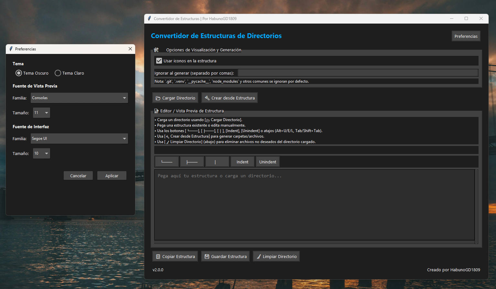
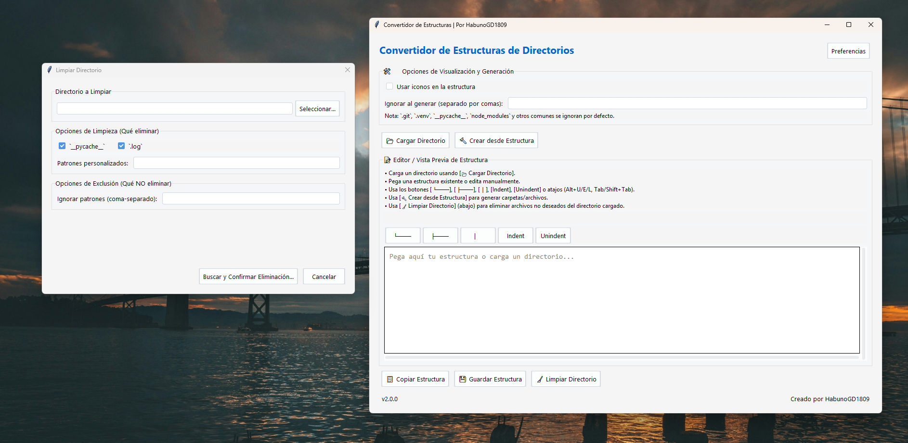
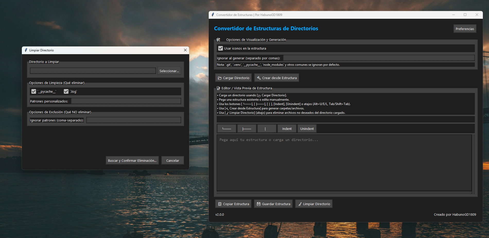
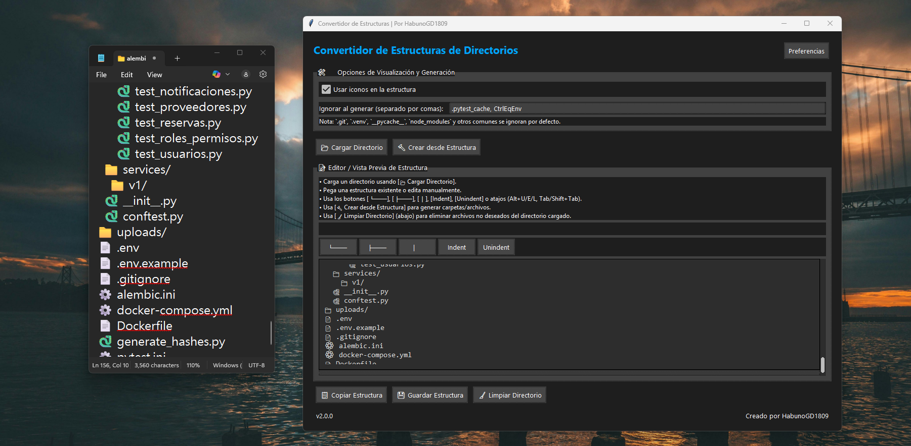
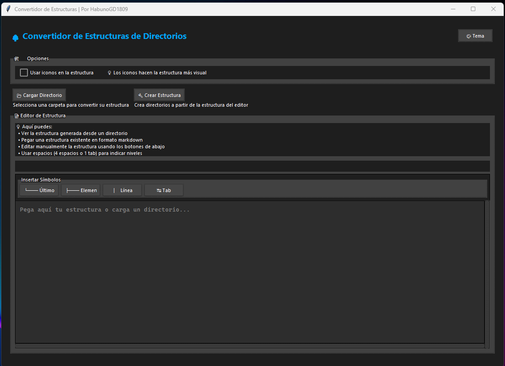

# 🌳 Convertidor de Estructuras de Directorios v2.2.0 🚀

Visualiza, crea y limpia estructuras de directorios sin esfuerzo. Esta aplicación convierte árboles de carpetas en texto fácil de entender (¡y viceversa!), te ayuda a generar proyectos desde cero y mantiene tus espacios de trabajo ordenados eliminando archivos basura.

---

## ✨ Características Destacadas (v2.2.0)

* 📁 **Visualización Inteligente:** Carga cualquier directorio y obtén una vista instantánea.
* 🎨 **Doble Formato:** Elige entre vista clásica de árbol (`├── └──`) o moderna con iconos (`📄 📁 🐍`).
* 🚫 **Filtros Flexibles y Persistentes:** Define patrones (`*.tmp`, `node_modules/`) para **excluir** al visualizar. Ahora puedes **guardarlos como predeterminados** para futuras sesiones.
* 🔍 **Buscador Integrado (NUEVO):** Presiona `Ctrl + F` dentro del editor para buscar rápidamente cualquier archivo o carpeta en estructuras gigantes.
* ✍️ **Editor Inteligente:** Modifica estructuras con botones rápidos o atajos (`Alt+U/E/L`).
* ↘️ **Pegado Anidado (NUEVO):** Usa `Alt + V` (o el botón "Pegar Dentro") para pegar una estructura del portapapeles y el sistema calculará automáticamente la indentación correcta para anidarla donde esté tu cursor.
* 🧹 **Limpieza de Comentarios (NUEVO):** Usa el botón "🧹 Sin #" para eliminar automáticamente todos los comentarios de una estructura pegada, sin romper el árbol.
* 🏗️ **Motor de Creación Robusto (NUEVO):**
  * Diseña tu estructura en texto y créala en tu disco duro.
  * Inteligencia para diferenciar entre archivos sin extensión (`Dockerfile`) y carpetas, basándose en la jerarquía.
  * Ignora automáticamente los comentarios en línea al crear las carpetas físicas.
* 🧹 **Limpieza Profunda (Diálogo Independiente):**
    * Selecciona cualquier carpeta a limpiar.
    * Elimina `__pycache__`, `.log`, o patrones personalizados.
    * **¡Protege tus archivos!** Define patrones a **ignorar** durante la limpieza.
    * Revisa antes de la **confirmación final**.
* ⚙️ **Personalización Total:** Tema claro/oscuro y fuentes ajustables.
* 📋 **Portabilidad:** Copia al portapapeles o guarda en archivos `.md` / `.txt`.

---

## 🖼️ Vistas Previas

<table>
  <tr>
    <td align="center">
      <b>Vista Principal (Tema Oscuro)</b><br>
      
    </td>
    <td align="center">
      <b>Vista Principal (Tema Claro)</b><br>
      
    </td>
  </tr>
  <tr>
    <td align="center">
      <b>Diálogo de Limpieza</b><br>
      
    </td>
    <td align="center">
      <b>Ejemplo Estructura (Iconos)</b><br>
      
    </td>
  </tr>
  <tr>
    <td align="center" colspan="2">
      <b>Vista Previa v1.0.0 (Interfaz Anterior)</b><br>
      
    </td>
  </tr>
</table>

---

## 🚀 Instalación

### Prerrequisitos

* Python 3.10 o superior (recomendado).
* pip (gestor de paquetes de Python).

### Pasos de instalación

1.  Clona el repositorio:
    ```bash
    git clone [https://github.com/HabunoGD1809/convertidor-directorios.git](https://github.com/HabunoGD1809/convertidor-directorios.git)
    cd convertidor-directorios
    ```
2.  (Recomendado) Crea y activa un entorno virtual:
    ```bash
    python -m venv ConvDirEnv
    # Windows: .\ConvDirEnv\Scripts\activate
    # macOS/Linux: source ConvDirEnv/bin/activate
    ```
3.  Instala las dependencias:
    ```bash
    pip install -r requirements.txt
    ```
4.  Ejecuta la aplicación:
    ```bash
    python main.py
    ```

---

## 🛠️ Uso

1.  **Cargar y Visualizar:**
    * (Opcional) Escribe patrones a ignorar en "Ignorar al generar". Marca "Guardar como predeterminados" si quieres conservarlos.
    * Clic en "📂 Cargar Directorio" y selecciona la carpeta.
    * Usa "Usar iconos" para cambiar vista.

2.  **Navegación y Búsqueda:**
    * Presiona `Ctrl + F` en el editor para buscar un archivo específico.

3.  **Editar/Crear Estructura Manual:**
    * Pega o escribe en el editor.
    * Usa `Alt + V` para pegar una estructura anidada dentro de la carpeta actual.
    * Usa "🧹 Sin #" para limpiar comentarios.

4.  **Crear Directorios Físicos:**
    * Clic en "🔨 Crear desde Estructura".
    * Selecciona directorio padre y confirma. (El sistema ignorará comentarios e íconos automáticamente).

5.  **Limpiar Directorio:**
    * Clic en "🧹 Limpiar Directorio".
    * En el diálogo, elige la carpeta, marca qué **eliminar** y qué **ignorar**.
    * Revisa la lista y confirma la eliminación permanente.

6.  **Copiar/Guardar:** Usa los botones correspondientes.
7.  **Preferencias:** Cambia tema y fuentes.

---

## 🚀 Futuras Mejoras (Roadmap)

¡Siempre hay espacio para mejorar! Aquí hay algunas ideas y funcionalidades que podrían llegar en futuras versiones:

* **Exportación Flexible:**
    * `- [ ]` Exportar la estructura generada a otros formatos como JSON, YAML o lista de texto simple indentada.
* **Importación Versátil:**
    * `- [ ]` Importar y visualizar estructuras desde formatos como JSON o listas indentadas.
* **Comparación de Directorios:**
    * `- [ ]` Opción para cargar dos directorios y resaltar visualmente las diferencias en sus estructuras.
* **Plantillas de Proyecto:**
    * `- [ ]` Guardar y cargar plantillas comunes de estructuras de directorios (ej. paquete Python, proyecto web básico).
* **Interfaz Mejorada:**
    * `- [ ]` Implementar una vista de árbol interactiva (expandir/colapsar nodos) como alternativa al editor de texto plano.
    * `- [ ]` Permitir arrastrar y soltar una carpeta sobre la ventana para cargarla directamente.
* **Personalización Avanzada:**
    * `- [ ]` Permitir al usuario definir sus propios mapeos de iconos para extensiones de archivo.

¡Las sugerencias y contribuciones son bienvenidas para hacer crecer este proyecto!

---

## 🤝 Contribuir

Fork -> Branch -> Commit -> Push -> Pull Request. Sigue PEP 8.

## 📄 Licencia

MIT License.

## ✨ Agradecimientos

* Python, Tkinter, ttkthemes Community.

## 📫 Contacto

HabunoGD1809 - [@Franklin_1809](https://x.com/Franklin_1809) 🐦 - franklinjoel1809@gmail.com 📧
